```{r, include=FALSE}
knitr::opts_chunk$set(eval=FALSE,fig.align='center', message = FALSE, warning=FALSE)
```

Date Completed: November 4, 2017

By: Connor Lenio

The following is a brief guide on how to access tables connected to a Dremio Server using macOS and R. The documentation on the Dremio website did not give explicit instructions on how to get this working using the ODBC drivers, so I figured it out myself!
```{r, eval=TRUE}
sessionInfo()
```

## Install unixODBC
* Using Homebrew in a Terminal window, install unixODBC
```{bash}
brew install unixODBC
```
<br>

* The end of the installation should look like this:
```{r, echo=FALSE, out.width='100%', eval=TRUE}
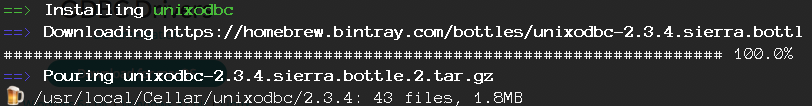
```

***

## Download and Install Dremio Server for macOS
* Navigate to https://www.dremio.com/download/
* Find the download link for Dremio Server and download to computer
```{r, echo=FALSE, out.width='100%', eval=TRUE}
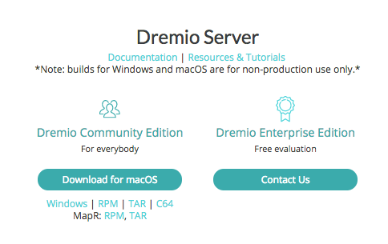
```
<br>
* Open .dmg and copy dremio-app to Applications folder

***

## Download and Install Dremio ODBC driver
* Navigate to https://www.dremio.com/download/
* Find the Download link for ODBC Drivers and download to computer
```{r, echo=FALSE, out.width='100%', eval=TRUE}
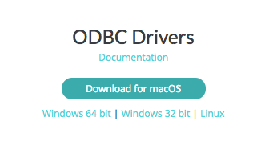
```
<br>
* Open .dmg and run .pkg executable to install drivers

***

## Verify Installation of ODBC Driver for Dremio (Optional)
* Navigate to http://www.odbcmanager.net/
```{r, echo=FALSE, out.width='100%', eval=TRUE}
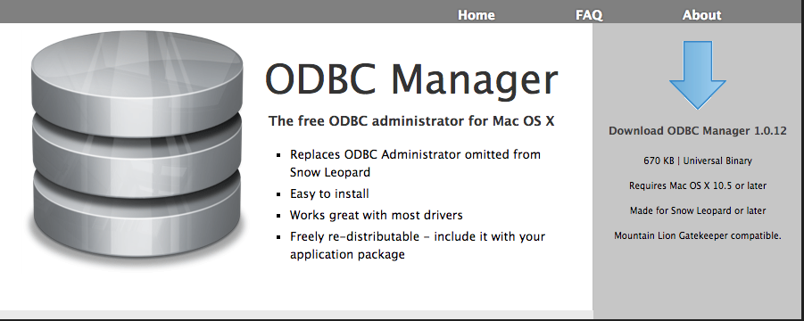
```
<br>
* Run the program once installed
* Verify that Dremio ODBC is listed


```{r, echo=FALSE, out.width='100%', eval=TRUE}
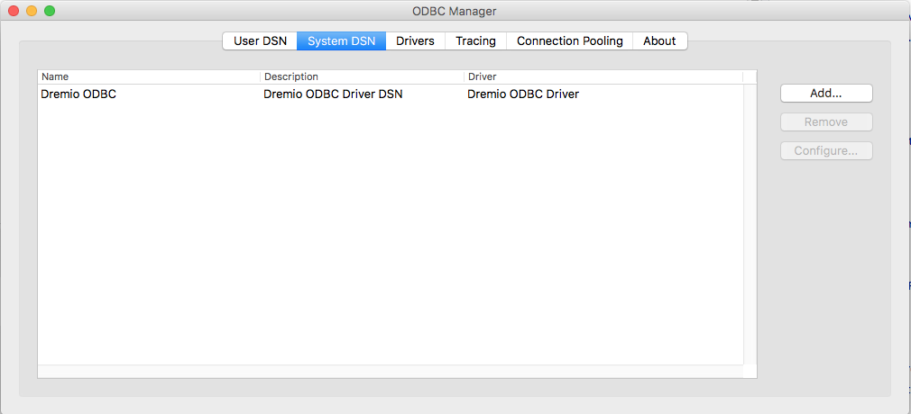
```

***


## Install latest version of odbc package
* Open R or RStudio and run the following code
```{r}
# make sure to use github version
devtools::install_github("r-dbi/odbc")
library(odbc)
```
<br>

### Check if odbc package is linked with Dremio Driver
* Run the following code once odbc is installed
```{r}
odbc::odbcListDrivers()
```
* If everything is ready, your output should look like this:
```{r, echo=FALSE, out.width='100%', eval=TRUE}
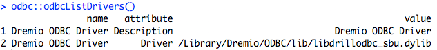
```
<br>

### Update "odbcinst.ini" and "odbc.ini" if no Dremio drivers listed
* If no Dremio Drivers are listed then open Terminal
* Change directories to Library/ODBC/
* Use a text editor like nano to open both "odbcinst.ini" and "odbc.ini"
```{bash}
cd /Library/ODBC/
nano odbcinst.ini
```
* Here is what "obdcinst.ini" looks like:
```{r, echo=FALSE, out.width='100%', eval=TRUE}
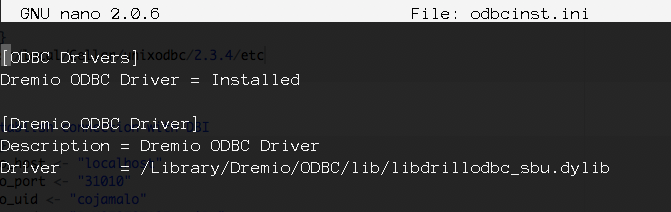
```
<br>
```{r}
nano odbc.ini
```
* Here is what "obdc.ini" looks like:
```{r, echo=FALSE, out.width='100%', eval=TRUE}
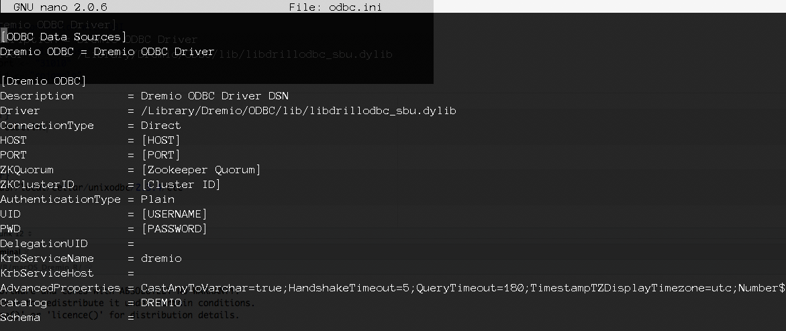
```
<br>
* Now in an additional Terminal window, change directory to /usr/local/Cellar/unixodbc/2.3.4/etc
```{r}
cd /usr/local/Cellar/unixodbc/2.3.4/etc
```
* You will find this directory also contains "odbc.ini" and "odbcinst.ini" files
```{r, echo=FALSE, out.width='100%', eval=TRUE}
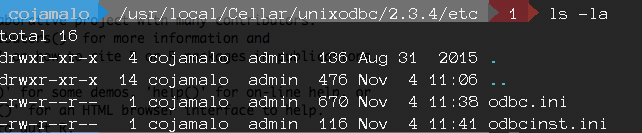
```
<br>
* Using your favorite text editor, update these two files in /usr/local/Cellar/unixodbc/2.3.4/etc to contain the same entries for the Dremio ODBC Driver from the matching files present in /Library/ODBC/
* Now odbc::odbcListDrivers() should list information for the Dremio Driver (You may need to restart R session to refresh)
```{r, echo=FALSE, out.width='100%', eval=TRUE}

```

***


## Establish connection with DBI
* Now you are ready to connect to your Dremio Server (this guide assumes Dremio Server is already up and running on your computer)
```{r}
library(odbc)
library(DBI)
library(tidyverse)
library(dbplyr)

dremio_host <- "localhost"
dremio_port <- "31010"
dremio_uid <- "your_username"
dremio_pwd <- "your_password"

con <- DBI::dbConnect(odbc::odbc(), 
                      driver = "Dremio ODBC Driver",
                      uid = dremio_uid, 
                      pwd = dremio_pwd, 
                      host = dremio_host, 
                      port = dremio_port,
                      AuthenticationType = "Basic Authentication", ConnectionType = "Direct")
```

***

## Use your Dremio data with dplyr functions
* This guide assumes you already have data present on your Dremio Server
* If you need to know the name of your table, navigate to the file using the Dremio Server UI (http://localhost:9047/) and look at the default SQL Editor name of the table (the string after "FROM" in the SQL Editor query)

```{r, echo=FALSE, out.width='100%', eval=TRUE}
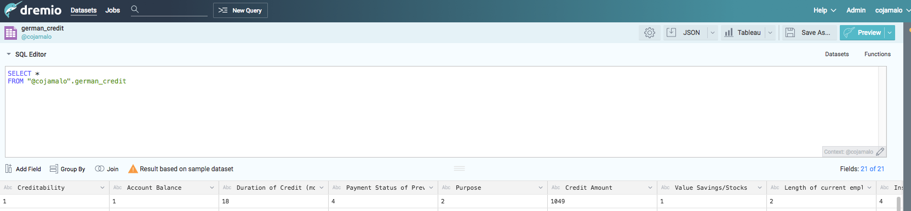
```
<br>

* Use this table name to reference the table in the following code
* Note the specific use of " and ' in the call below. 
```{r}
con %>% tbl(sql('SELECT * FROM "@cojamalo".german_credit')) %>% arrange(Purpose)
```
```{r, echo=FALSE, out.width='100%', eval=TRUE}
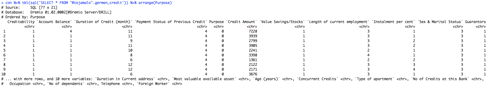
```
<br>

* Alternatively, you can save the link to the table to a variable
```{r}
dremio_tbl = con %>% tbl(sql('SELECT * FROM "@cojamalo".german_credit'))
```

